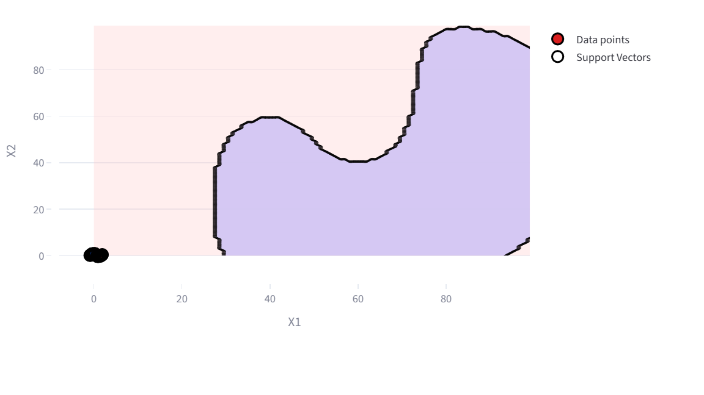
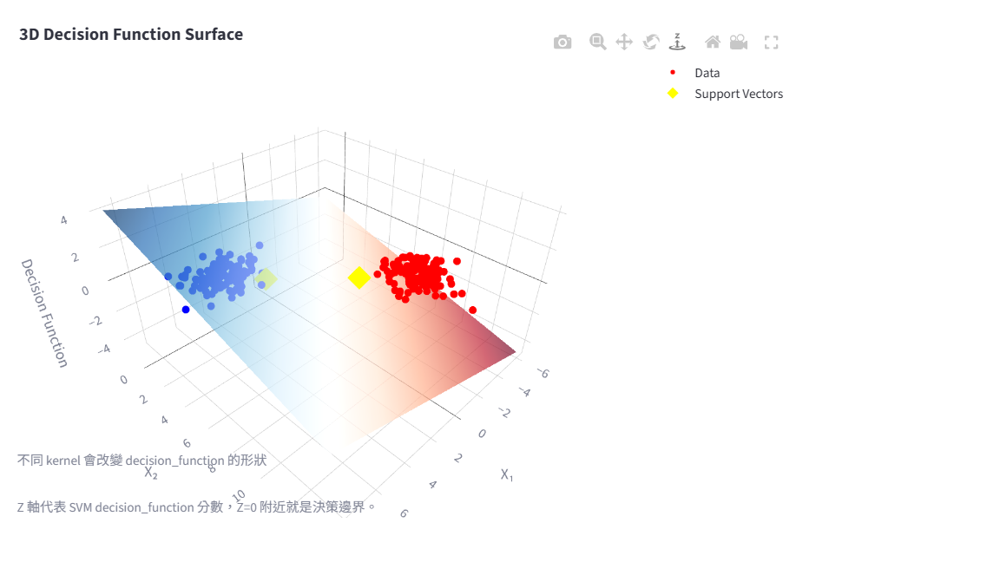
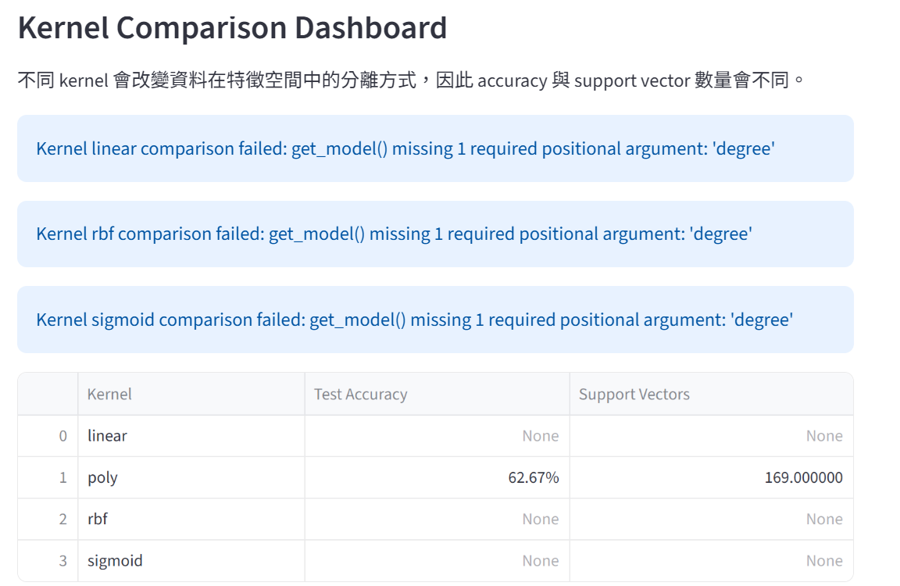
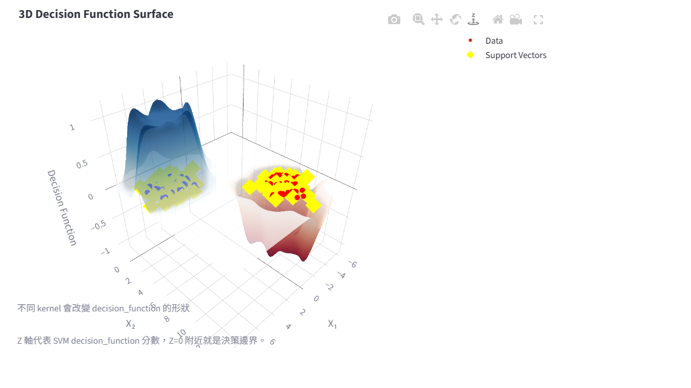

# 🎓 SVM Interactive Teaching Platform

## 📖 Project Introduction
A **teaching‑focused interactive web app** built with **Streamlit**, **scikit‑learn**, **Plotly**, and **Manim** that lets users explore Support Vector Machines (SVM) concepts and visualisations in real‑time.

## 🌐 Live Demo
[🔗 Live Demo – Streamlit Cloud](https://robin-l13-svm.streamlit.app)

## 📦 GitHub Repository
[🐙 robinrobinlin‑bit/L13‑SVM](https://github.com/robinrobinlin-bit/L13-SVM)

---

## ✨ Project Highlights
| ✅ | Feature |
|---|---|
| 🎨 | 2D & 3D interactive decision‑boundary visualisation |
| 🔁 | Real‑time kernel comparison (linear, poly, rbf, sigmoid) |
| 🎞️ | Pre‑rendered Manim animations for margin & support‑vector explanation |
| 📊 | Dataset generation (blobs, moons, circles, linear classification) |
| 🐞 | Debug‑friendly logging and clear UI layout |
| 🚀 | Deployable on Streamlit Community Cloud |

---

## 🛠 Tech Stack
| 🧰 Component | 📚 Library |
|--------------|------------|
| Web framework | **Streamlit** |
| Machine learning | **scikit‑learn** |
| Interactive charts | **Plotly** |
| Educational animations | **Manim Community** |
| Language | **Python 3.12** |

---

## 📊 Workflow Diagram


---

## 📸 Screenshots
| Feature | Image |
|--------|-------|
| Interactive SVM UI |  |
| 3D Support Vector view |  |
| Kernel Comparison Dashboard |  |
| RBF Bowl Surface |  |

---

## 📂 Project Structure
```
├─ app.py                     # Streamlit entry point
├─ src/                       # Core Python modules
│   ├─ data_generator.py      # Dataset creation utilities
│   ├─ svm_model.py           # Wrapper for scikit‑learn SVC
│   └─ plots_2d.py           # 2‑D Plotly visualisations
├─ pages/                     # Streamlit pages (one per tutorial step)
│   ├─ 1_Linear_SVM.py
│   ├─ 2_Margin_Support_Vectors.py
│   ├─ 3_Kernel_Trick.py
│   ├─ 4_RBF_Decision_Surface.py
│   └─ …
├─ manim_scenes/              # Manim animation scripts
├─ assets/
│   ├─ videos/                # Rendered Manim videos
│   └─ screenshots/           # Images used in this README
├─ requirements.txt           # Python dependencies
└─ workflow.png               # Workflow diagram (shown above)
```

---

## 🔮 Future Work
- Add **interactive hyper‑parameter tuning** for C, gamma, and degree.
- Implement **model export** (ONNX/PMML) for downstream use.
- Expand documentation with **multilingual tutorials**.
- Integrate **unit tests** and CI pipeline for automated verification.
- Deploy a **Docker image** for reproducible local setup.

---

## 📄 License & Acknowledgements
- Content written in Traditional Chinese, inspired by scikit‑learn docs and various SVM tutorials.
- Manim animations derived from the Manim Community Edition examples.
- Contributions and issues are welcome via GitHub.
