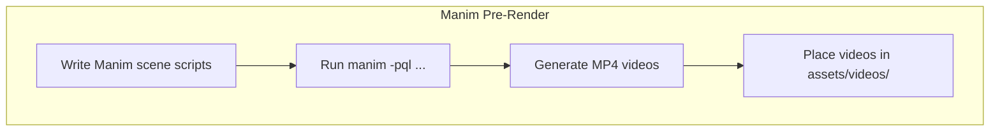
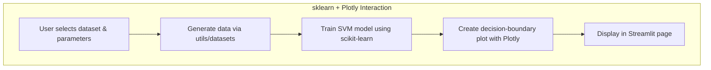
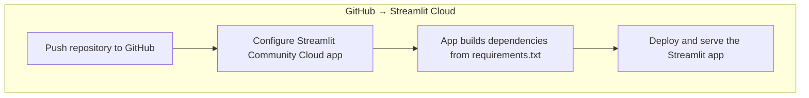

# Workflow Documentation

```mermaid
flowchart TD
    subgraph Manim_PreRender[Manim Pre‑Render]
        A[Write Manim scene scripts] --> B[Run manim -pql ...]
        B --> C[Generate MP4 videos]
        C --> D[Place videos in assets/videos/]
    end
```

```mermaid
flowchart TD
    subgraph Interactive[sklearn + Plotly Interaction]
        E[User selects dataset & parameters] --> F[Generate data via utils/datasets]
        F --> G[Train SVM model using scikit‑learn]
        G --> H[Create decision‑boundary plot with Plotly]
        H --> I[Display in Streamlit page]
    end
```

```mermaid
flowchart TD
    subgraph Deployment[GitHub → Streamlit Cloud]
        J[Push repository to GitHub] --> K[Configure Streamlit Community Cloud app]
        K --> L[App builds dependencies from requirements.txt]
        L --> M[Deploy and serve the Streamlit app]
    end
```
